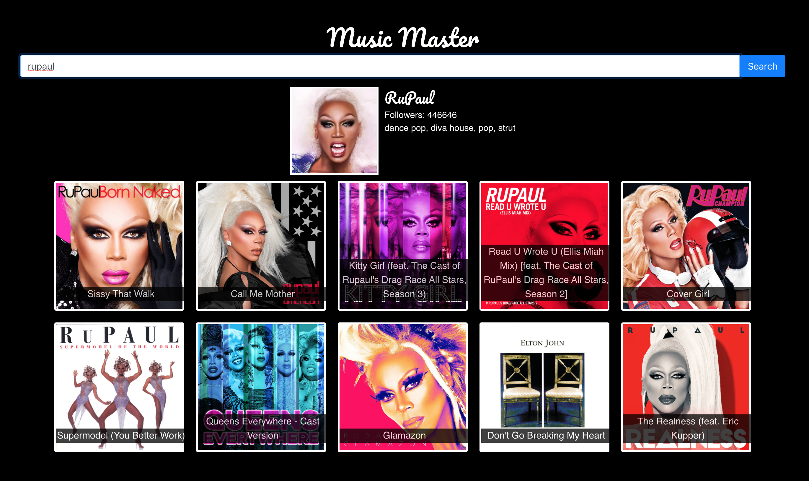

# Music Master

Search for an artist and get top tracks using the Spotify API

### Set up API keys

```
cp .env.example .env.local
```

Create a new spotify application and copy the client_id and client_secret into the corresponding react app variables in .env.local

https://developer.spotify.com/dashboard/applications

### Run

```
npm install
npm start
```


